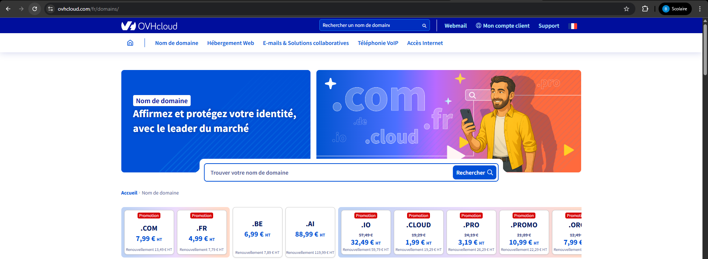
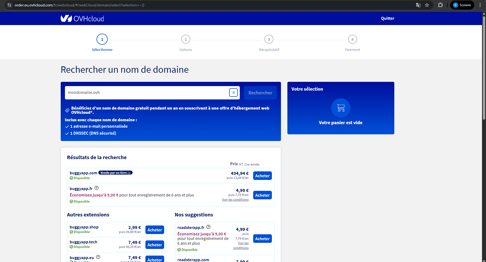
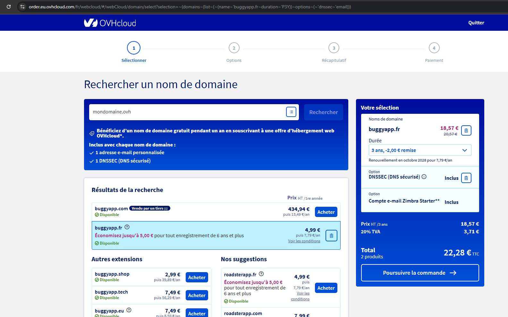

# Questions

Répondez ici aux questions théoriques en détaillant un maxium vos réponses :

1) Expliquer la procédure pour réserver un nom de domaine chez OVH avec des captures d'écran (arrêtez-vous au paiement) :

Tout d'abord aller sur la page https://www.ovhcloud.com/fr/domains/
</img>

Lancer une recherche depuis la barre de recherche tel que : __buggyapp__
</img>

Divers noms de domaines sont proposés, __buggyapp.fr__ me semble être une offre intéressante

Cliquez sur acheter
</img>

Cliquer sur poursuivre la commande, et en bas de la page cliquez sur __Suivant__
De nouveau suivant, il vous faudra un compte OVH pour continuer

2. Comment faire pour qu'un nom de domaine pointe vers une adresse IP spécifique ?

Dans __AAPanel__, dans l'onglet __Website__, et que l'on va sur la configuration de notre site, nous pouvons ajouter un nouveau nom de domaine
Il suffira de rajouter celui que nous avons sur OVH

Je pense que sur la plateforme OVH il faut renseigner l'adresse IP de notre VPS
Et que sur AAPanel on doit rajouter le nom de domaine acheté sur OVH

3. Comment mettre en place un certificat SSL ?

Dans __AAPanel__, dans l'onglet __Website__, et que l'on va sur la configuration de notre site, nous pouvons nous rendre dans __l'onglet SSL__
Puis dans ce sous-menu, nous pouvons aller sur l'onglet __Let's Encrypt__
Il faudra séléctionner tous les noms de domaines disponibles, cliquer sur __Apply__, et activer la partie __Force HTTPS__ (équivalent de __HSTS__ je suppose)